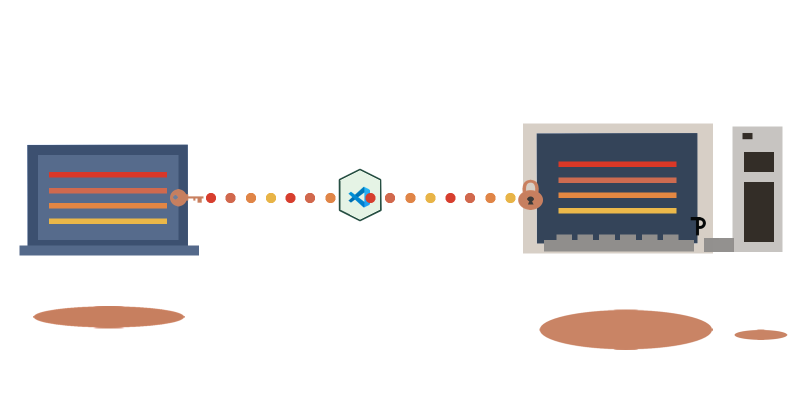

This repo will help you install, manage and effectively use Visual Studio Code or VS Code. 

<!--  SHIELDS  -->

# Table of Contents
- [How To Read This](#how-to-read-this)
- Documentation
    - [Connecting Two Local Machines via SSH](./ssh.md)
- [Extra Reading](#extra-reading)
- [Contributing](#contributing)
- [License](#license)
- [Contact](#contact)
 

# How To Read This
Included in this repository are the steps that I took in order to work with VS Code on my different machines. There will be links to the respective documentation for that subject, either open within the repo files or through the **Documentation** section links.
- If you would like to jump to sections and you are within the GitHub website, locate the **Table of Contents** menu in the upper left of this repo header (and select from the dropdown
- Using Linux, you can use chroot dualboot or enable Linux on your Chromebook, either way it is personal preference.
- Example code may have **~$** or any symbols before the command, do not copy that into your terminal.
- If there are multiple lines of code, copy each complete line as one respective command, unless told otherwise

(<a href="#top">back to top</a>)

# Extra Reading
- [VS Code Remote SSH](https://code.visualstudio.com/docs/remote/ssh)
- [IP Addresses Wiki](https://en.wikipedia.org/wiki/IP_address)
- [MDN Client-Server Overview](https://developer.mozilla.org/en-US/docs/Learn/Server-side/First_steps/Client-Server_overview)
- [MDN Command Line Course](https://developer.mozilla.org/en-US/docs/Learn/Tools_and_testing/Understanding_client-side_tools/Command_line)
- [Linux IP-Address manpages](https://man7.org/linux/man-pages/man8/ip-address.8.html)

(<a href="#top">back to top</a>)

<!-- CONTRIBUTING -->
## Contributing
Thanks for checking out this repo, hopefully it will/has assisted you. If you found any edits or want to contribute, please do, it might assist someone who was struggling with this subject.

Submit an issue or I encourage you to fork this repo and contribute to this project!

Contributions are what make the open source community such an amazing place to learn, inspire, and create. Any contributions you make are **greatly appreciated**.

1. Fork the Project
2. Create your Feature Branch (`git checkout -b my-edits)
3. Commit your Changes (`git commit -m 'Add some new edits to <documentation> for <what it does>'`)
4. Push to the Branch (`git push origin new edits`)
5. Open a Pull Request

(<a href="#top">back to top</a>)

<!-- LICENSE -->
## License
Distributed under the MIT License. See `./LICENSE` for more information.

(<a href="#top">back to top</a>)

<!-- CONTACT -->
## Contact
Tanya - [@wonntann](https://twitter.com/wonntann)

Project Link: [https://github.com/wonntann/vscode](https://github.com/wonntann/VS-Code)

(<a href="#top">back to top</a>)

