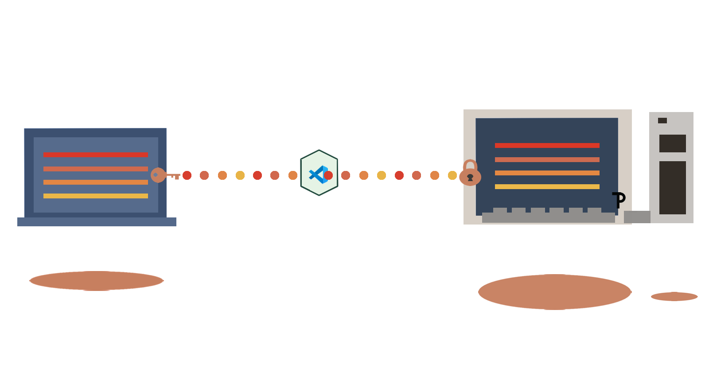
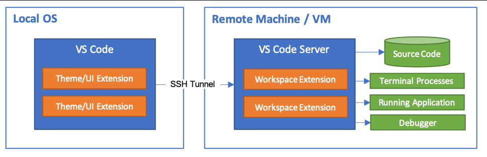

This repo will help you remotely connect to different authorized computers on the same network via SSH and walk you through the steps to use VS Code Remote SSH extension.

<div id="top"></div>



# Table of Contents
- [How To Read This](#how-to-read-this)
    - [Learning Objectives](#learning-objectives)  
    - [Terminology](#terminology)  
    - [What You Need](#what-you-need")
    - [Requirements For Two Machines On The Same Network](#requirements-for-machines-on-the-same-network)
    - [Extension Used In This Repository](#extension-used-in-this-repository) 
- [What Is SSH?](#what-is-ssh?)
    - [Common Uses](#common-uses)
- [How To Connect Your Machine](#how-to-connect-your-machine)
    - [Exercise 1: Connecting Two Local Machines via SSH](#exercise-1-connecting-two-local-machines-via-ssh)
    - [Exercise 2: Working in VS Code](#exercise-2-working-in-vs-code)
- [Extra Reading](#extra-reading)
- [License](#license)
- [Contact](#contact)
 

# How To Read This
Below are the steps that I took in order to connect via VS Code over SSH on the same network with two different machines. Optionally, you can go through the first exercise to connect the machines via SSH, then go through the second exercise to connect vis the VS Code SSH extension, in order to work with your files with a text editor called VS Code.
<p align="right">(<a href="#top">back to top</a>)</p>

## Learning Objectives
- First exercise will connect two remote machines via SSH
- Second exercise will open the files on the remote machine in VS Code via the remote extension
<p align="right">(<a href="#top">back to top</a>)</p>

## Terminology
- SSH
- Client/Computer2
- Server/Remote host
- Hostname
- IP address
- Terminal/Command Line/Bash
<p align="right">(<a href="#top">back to top</a>)</p>

## What You Need
- Computer username (name used to login)
- Hostname (can be IP address computer is connected to)
    - On Linux, to find the ip address, **enter** **ip add** into the terminal
    ``` bash
    ~$ ip add
    ```
    Look at the **2: eno1: inet** IP address. This local address will only be used with this internal network. It can look like 172.16.4.3, 192.168.9.4, 10.0.0.13.

    - On Windows using the command prompt:
     - Type **ipconfig** into the terminal
    ``` bash
    ~$ ipconfig
    ```
    Look at the **Default Gateway**  and the IP address will be the 

    - On MacOS using the terminal:
    ``` terminal
    ~$ ipconfig getifaddr en1
    ```
- Two machines with met requirements from below

<p align="right">(<a href="#top">back to top</a>)</p>


<div id="requirements"></div>

## Requirements For Two Machines On The Same Network
1. On client machine: Install [OpenSSH compatible SSH client](https://code.visualstudio.com/docs/remote/troubleshooting#_installing-a-supported-ssh-client)
2. On server machine: Install [OpenSSH compatible SSH server](https://code.visualstudio.com/docs/remote/troubleshooting#_installing-a-supported-ssh-server)
3. Install [Visual Studio Code](https://code.visualstudio.com/)
4. Install [Remote Extension](https://marketplace.visualstudio.com/items?itemName=ms-vscode-remote.remote-ssh)

<p align="right">(<a href="#top">back to top</a>)</p>

## Extension Used In This Repository
- [Remote - SSH Extension](https://marketplace.visualstudio.com/items?itemName=ms-vscode-remote.remote-ssh)

# What Is SSH?
SSH, secure shell protocol, allows access to a remote machine (i.e. computer, virtual machine, raspberry pi...), by implementing the client-server model. In this example, a server host will share their resources to the client, while the client will request a service from a server and not reciprocate in sharing resources. The server can be defined as the host machine that is housing the desired data and the client is another machine that is capable of receiving that data. This access is not limited to folders and files, SSH allows you to access an app on a different machine, affording you the ability to view, modify, run and/or debug the files located on the connected device.

Along with this ease of file access, there is an inherent security risk. Only connect to known and trusted sources since you will be accessing your entire machine remotely and do not share your SSH keys.
<p align="right">(<a href="#top">back to top</a>)</p>

## Common Uses
Schools
    - SSH into lab machines to access that machine's dependencies required for an assignment, without needing that sepcific operating system.

Home
    - Want to access information/documents on another computer already setup with SSH. Allows you to transfer files over SSH over using a USB, the cloud, or any other external device.

<p align="right">(<a href="#top">back to top</a>)</p>


# How To Connect Your Machine
## Exercise 1 Connecting Two Local Machines via SSH
1. Setup SSH host
    - Install the ssh openssh on the server (machine #1 that is hosting information and connecting to the other machine)
- On Linux:
    ``` bash
    sudo apt-get install openssh-server
    ```
- On Windows: [OpenSSH](https://docs.microsoft.com/en-us/windows-server/administration/openssh/openssh_install_firstuse)

- On Mac: Comes pre-installed

2. Connect to a remote host/computer2
    - Enter the following command in the client terminal, making sure to replace the username with the host machine's \<username> and the \<hostname> with the ip address for that host machine.
    ``` bash
    ssh <username>@<hostname>
    ```
3. Once your terminal connects to the host machine, the username and hostname will be in the terminal. You can access all of the files via the terminal and edit the files via Vim, nano or transfer it to the device.

Next, I will take you through the steps to SSH into the host machine via VS Code.
<p align="right">(<a href="#top">back to top</a>)</p>

## Exercise 2: Working in VS Code


Image courtesy of [Visual Studio Code](https://code.visualstudio.com/docs/remote/ssh)

VS Code permits connection over SSH into another machine using VS Code to interact with files and folders on the remote filesystem. Connecting to the separate machine through VS Code, allows you to access any tools or dependencies pre-installed on that remote machine.

Now that you have connected via SSH you can connect straight through the VS Code extension. If you didn't follow the SSH, you can still accomplish the connection via VS Code, as long as the <a href="#requirements">requirements</a> are met.

1. Open VS Code, and open the remote SSH-Open SSH Host by clicking <div align="center"> </div>

and ***Connect to host*** or connect to your host that you just set up.
2. If your hostname is not in the dropdown selection, type your user and hostname then hit **enter**
3. If prompted, enter you host password
4. Navigate to **Open Folder** or hit **CTRL** + **o** to start accessing the files on the host.

<p align="right">(<a href="#top">back to top</a>)</p>

# Extra Reading
- [VS Code Remote SSH](https://code.visualstudio.com/docs/remote/ssh)
- [IP Addresses Wiki](https://en.wikipedia.org/wiki/IP_address)
- [MDN Client-Server Overview](https://developer.mozilla.org/en-US/docs/Learn/Server-side/First_steps/Client-Server_overview)
- [MDN Command Line Course](https://developer.mozilla.org/en-US/docs/Learn/Tools_and_testing/Understanding_client-side_tools/Command_line)
- [Linux IP-Address manpages](https://man7.org/linux/man-pages/man8/ip-address.8.html)

<!-- LICENSE -->
## License
Distributed under the MIT License. See `./LICENSE` for more information.

<p align="right">(<a href="#top">back to top</a>)</p>


<!-- CONTACT -->
## Contact
Tanya - [@wonntann](https://twitter.com/wonntann)

Project Link: [https://github.com/wonntann/vscodes](https://github.com/wonntann/vscode)

<p align="right">(<a href="#top">back to top</a>)</p>

